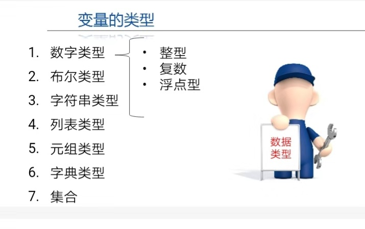
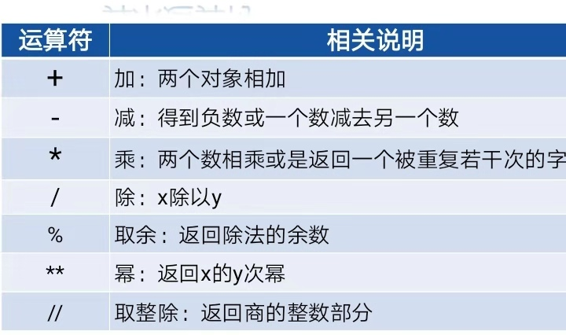
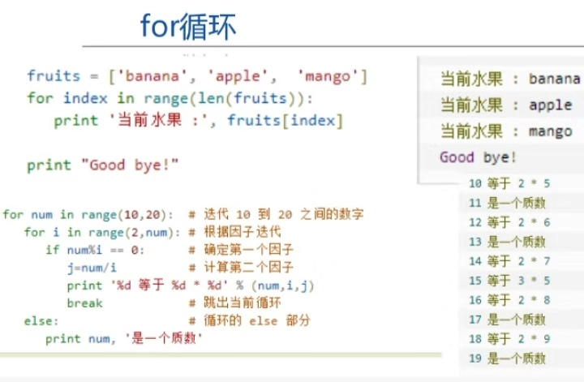
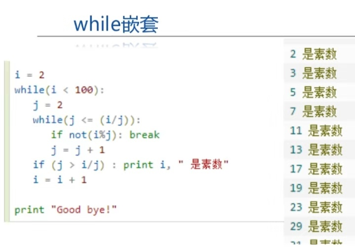

## 我的第一个博客
## Header 2
### Header 3
   这是我的第一个博客，介绍点什么好呢，好，就我最近学的Python吧（大佬勿喷），我只是简单的介绍一下

### 1.认识Python
  Python有挺多优点，但一些用惯了C/C++的coder反而不太习惯它的语法，单个人觉得，如果习惯并熟练使用后，Python是个挺好用的工具。Python的主要优点有：易于学习、易于阅读、可移植、可嵌入、GUI编程和数据库等等。

### 2.接下来是什么
那肯定就是下载Python和Pycharm啦。下载Python的网址：http://www.python.org/download/ ，下载Pycharm网址：https://www.jetbrains.com/pycharm/download/#section=windows ,接下来就是配置环境变量了， 这些网上教程一大堆，本蒟蒻就不多说了。 
### 3.基本语法：
  a.Python中的单行注释以 # 开头！
  b.行与缩进：Python最具特色的就是使用缩进来表示代码块，一定要注意代码的缩进。
  c.变量和数据类型：变量分为数字类型（整型、复数、浮点型），布尔类型， 字符串类型，列表类型，元组类型，字典类型，集合。
  
  
  d.运算符：算术运算符、赋值运算符、符合运算符、比较运算符等等。
  ：
  
  
### 4.常用语句：
1.if-else（elif）判断语句 ：用法与C/C++相似，但没有大括号，要注意缩进。
2.while和for的循环语句：如下图：



3.pass空语句：为了保持程序结构完整性，不起任何作用。


### 5.字符串：
  字符串是一种表示文本数据的类型。
  1.字符串的输出：

``` javascript
name = '德林'
age = 5
print("大家好， 我叫%s， 我今年%d岁了"%（name， age）)

```
2.字符串的输入：

``` javascript
username = input("请输入用户名")
print(username)
```

3.切片：
假设有字符串 name = "abcdef"， 则：
``` javascript
name[0:3]-------->abc
name[3:5]-------->de
name[1:-1]------->bcde
name[2:] --------->cdef
name[::-2]-------->fbd
```


